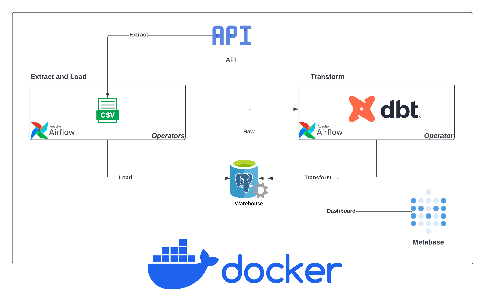
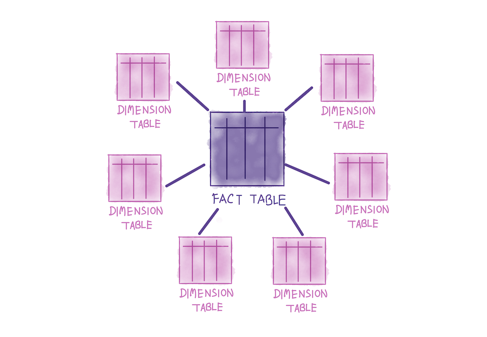

# ELT Pipeline
<center>

</center>

System diagram of this assessment's ELT pipeline. Part of the assignment is to understand the diagram and implement it step by step. Necessary comments are provided inside the code file to help you. Please read the doc and follow the steps.

### Prerequisite: Install Docker & Docker Compose

Please follow Docker's official documentation to install both packages on you system:

- [Docker installation guide (Win, Mac, Linux)](https://docs.docker.com/get-docker/)
- [Docker Compose installation guide (Win, Mac, Linux)](https://docs.docker.com/compose/install/)

### How to run the code
Run in a local environment by going into the root directory and execute:
```shell
docker compose up -d
```
> **N.B.**: Depending on your machine's operating system (this is true for Linux and WSL) the `airflow-init` container may exit with the following error: `PermissionError: [Errno 13] Permission denied: '/opt/airflow/logs/scheduler'`. If you encounter this issue, it can be easily resolved by running the following command in the root of the folder (same level as the docker compose yaml file): `sudo chmod -R 777 logs/`

After Airflow webserver is running, open Airflow in your local browser at the following address:
```
localhost:8080
```
with username: `airflow`
and password: `airflow`

After Metabase is running, open Metabase in your local browser at the following address:
```
localhost:3000
```
then create a user login account and connect to the data warehouse 
with username: `admin`
and password: `admin`
and database: `warehouse`
and host: `warehouse`
and port: `5432`

> You don't need to change any config to run the project

* All the required external python packages are already install inside docker
1. requests
2. sqlalchemy
3. python-ulid 
4. dbt-postgres
5. pandas

> You are free to use any built-in python packages

> Make sure you git initilize the repo and commit your changes properly.

# Questionnaire

## Software Engineer Focused

### Problem Statement
Fetch random user data with the provided api. 

#### Context
- Here is sample of the api reference.
```json
{
  "results": [
    {
      "gender": "female",
      "name": {
        "title": "Miss",
        "first": "Jennie",
        "last": "Nichols"
      },
      "location": {
        "street": {
          "number": 8929,
          "name": "Valwood Pkwy",
        },
        "city": "Billings",
        "state": "Michigan",
        "country": "United States",
        "postcode": "63104",
        "coordinates": {
          "latitude": "-69.8246",
          "longitude": "134.8719"
        },
        "timezone": {
          "offset": "+9:30",
          "description": "Adelaide, Darwin"
        }
      },
      "email": "jennie.nichols@example.com",
      "login": {
        "uuid": "7a0eed16-9430-4d68-901f-c0d4c1c3bf00",
        "username": "yellowpeacock117",
        "password": "addison",
        "salt": "sld1yGtd",
        "md5": "ab54ac4c0be9480ae8fa5e9e2a5196a3",
        "sha1": "edcf2ce613cbdea349133c52dc2f3b83168dc51b",
        "sha256": "48df5229235ada28389b91e60a935e4f9b73eb4bdb855ef9258a1751f10bdc5d"
      },
      "dob": {
        "date": "1992-03-08T15:13:16.688Z",
        "age": 30
      },
      "registered": {
        "date": "2007-07-09T05:51:59.390Z",
        "age": 14
      },
      "phone": "(272) 790-0888",
      "cell": "(489) 330-2385",
      "id": {
        "name": "SSN",
        "value": "405-88-3636"
      },
      "picture": {
        "large": "https://randomuser.me/api/portraits/men/75.jpg",
        "medium": "https://randomuser.me/api/portraits/med/men/75.jpg",
        "thumbnail": "https://randomuser.me/api/portraits/thumb/men/75.jpg"
      },
      "nat": "US"
    }
  ]
}
```
- The response contains user data such as name, age, nationality, picture and some other info.

#### Tasks
1. Implement the provided functions in `extract.py` file, which should make a api call using multiprocessing or multithreading  and write all the reposponse in a flat csv file.
2. Implement the provided functions in `migration.py` file, which makes sure
that csv file and directory and database schema and table existing before we 
write and load data in them.
3. Implement the provided functions in `load.py`, which reads the flat csv file and bluk load its data in the data warehouse using appropriate data base connection string.
4. Implement the provided functions in `model.py`, which setups the db connection and also defines python users object model. 
5. Do not change the `config.py` file.
6. Do not change the provided functions, you can add you own functions and call them from the provided functions. 

## Database Focused

### Problem Statement
Initilize necessary sql schema and table for out docker data warehouse container. 

#### Context
- When we start warehouse (postgres) docker container, we like to init with proper schema and table for our raw data. 

#### Tasks
Define schema and table in root `scripts` folder by following the steps:

1. Create a schema named `raw`. You should drop the schema if it already exist.
2. Create a table called `users` under `raw` schema. The table should have all the column you got from the api response. You deside the type of each column (but should be appropiate based on the value you recived in the api response). It should have a id column using UUID as primary key and not null. You should drop the table if it already exist.


## Data Engineering Focused

### Problem Statement
Create a [Airflow](https://airflow.apache.org/) pipeline which runs once a daily. 

#### Context
- Our random user api return user object. We would like to fetch a set of random user data daily and load it our data warehouse. A default args is provided, use it to init you dags.


#### Tasks
Create two Data pipeline (DAG) in Python with following steps:

1. Airflow dags should be configured as  follows:
 > 1. retries: 3
 > 2. retry delay: 3
 > 3. schedule interval: daily
 > 4. start date: you decide
2. So far the python scripts that you have written in previous steps by utilizing them implement your airflow dag.
3. The two dags are defined in `extract_load_pipeline.py` and `transform_pipeline.py` file.
4. All the task in the dag should be run using `bashoperator`.
5. For the `transform_pipeline.py` which is already partially written for you. You need to make sure that the `bashoperator` runs `dbt build` command in the `dbt_project` directory to generate dimentional models.

## Dimensional Modeling Focused

### Problem Statement
Create a [dimensional](https://en.wikipedia.org/wiki/Dimensional_modeling) dimensional modeling reprezentation of the raw data. 

#### Context
- In the previous task we tried to generate dimensional model using dbt. It is not required for to know dbt or how to use dbt. If you are not able to write `transform_pipeline.py`. Then you need to design the dimentional model by hand or some ERD diagram tool.

#### Tasks

1. Create a dimensional modeling from our raw `users` data.
2. Some of the fact we would like to know from dimentional model is age, nationality and gender.
3. If you are up for a challenge then implement the dimensioanl model using dbt inside `dbt_project`. All necessary config are all ready provided. You just have to implement everything inside `models -> mart` and `models -> staging` folder.
4. You can name your `dim` and `fact` table as you like.

Example diagram:

<center>

</center>

## Data Analytics Focused

### Problem Statement
Create some basic analytics by querying the dimensional models. 

#### Context
- In the previous task you converted the raw `users` data into a more analytics firendly format using dimensional model. Now we would like to get some results by querying the model.


#### Tasks

1. Tasks here is open-ended, from the data you have in your hand ask some basic questions about the data and write sql query to answer those questions.
2. Chalenge here is to write your query in `metabase` software. Which you can only do if you have answered correctly `transform_pipeline.py` and created your dimension and fact table in `dbt` properly.
3. Don't worry if you haven't. Write question below and and it's sql query.

Example:

Q: What is the population count by age group in the increment of 10 upto 100?
```sql
select * from dim_user, fact_age
``` 


# Reference
1. [DBT](https://www.getdbt.com/) 
2. [DBT Tutorial](https://www.youtube.com/watch?v=pKPG7oDZEIU&ab_channel=TrevorHigbee)
3. [Metabase](https://www.metabase.com/)
4. [Airflow](https://airflow.apache.org/)
5. [Dimensional Modeling](https://en.wikipedia.org/wiki/Dimensional_modeling) 
